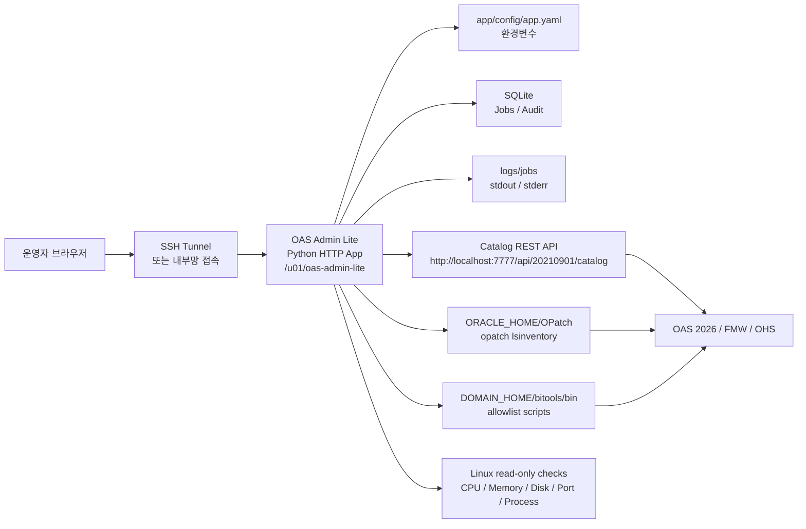

# OAS Admin Lite

OAS Admin Lite는 Oracle Analytics Server 2026 운영자를 위한 경량 온디맨드 Admin 웹앱입니다.

앱은 `oracle` 계정으로 필요할 때만 실행하는 것을 기준으로 하며, OAS 서버에 systemd 서비스나 sudoers를 등록하지 않습니다. 앱 파일, 로그, 작업 이력, 백업, 패치 staging 파일은 `/u01/oas-admin-lite` 아래에 모아두는 구조입니다.

상세 소개 문서는 [docs/INTRODUCTION.md](docs/INTRODUCTION.md)를 참고하세요.

## 아키텍처 개요

OAS Admin Lite는 OAS 서버 안에서 `oracle` 계정으로 필요할 때만 실행되는 Python 웹앱입니다. Resources는 OAS 서버 상태를 조회하고, 앱 실행 이력과 설정값은 Jobs / Audit 및 Settings에서 분리해 보여줍니다.



## 주요 기능

- Resources: 첫 화면으로 CPU, Memory, Swap, `/u01` Disk, OAS 런타임 경로, OAS/OHS listener, OAS/OHS process 상태 조회
- Catalog: OAS REST API 기반 유형별 현황, owner, 변경일, 폴더 구조, ACL 리스크 대시보드
- Patch: `opatch lsinventory` 기반 현재 패치 레벨 조회
- Scripts: allowlist 기반 OAS 관리 스크립트 실행
  - `diagnostic_dump.sh`
  - `exportarchive.sh`
- Jobs / Audit: SQLite 기반 작업 이력 저장
- Settings: 현재 설정 조회

## 요구 사항

운영 서버 기준:

```text
Linux
python3 3.6 이상
bash
tar / gzip
oracle 계정
OAS / OHS / FMW / OPatch 기존 설치
```

추가로 설치하지 않아도 되는 항목:

```text
pip package
Node.js
외부 DB
systemd service
sudoers
nginx/apache 추가 설치
```

Python 3.6 이상 표준 라이브러리만 사용합니다.

## 권장 배포 위치

```text
/u01/oas-admin-lite
```

권장 소유자:

```bash
oracle:oinstall
```

권장 권한:

```bash
chmod -R 750 /u01/oas-admin-lite
```

## Git Clone 방식 배포

고객 서버에서 Git 접근이 가능한 경우, `oracle` 계정으로 직접 clone할 수 있습니다.

```bash
su - oracle
cd /u01
git clone <REPOSITORY_URL> oas-admin-lite
cd /u01/oas-admin-lite
chmod +x scripts/*.sh
```

설정 파일을 생성합니다.

```bash
mkdir -p app/config
cp configs/app.yaml.sample app/config/app.yaml
vi app/config/app.yaml
```

주요 설정 예시:

```yaml
server:
  listen: "127.0.0.1:18080"

paths:
  root: "/u01/oas-admin-lite"
  data_dir: "/u01/oas-admin-lite/data"
  log_dir: "/u01/oas-admin-lite/logs"
  backup_dir: "/u01/oas-admin-lite/backups"
  bundle_dir: "/u01/oas-admin-lite/bundles"
  package_dir: "/u01/oas-admin-lite/packages"

oas:
  oracle_home: "/u01/app/oracle/product/fmw"
  domain_home: "/u01/app/oracle/config/domains/bi"
  bitools_bin: "/u01/app/oracle/config/domains/bi/bitools/bin"
  analytics_url: "https://oas.example.com/analytics"
  catalog_base_url: "http://localhost:7777"
  catalog_api_path: "/api/20210901/catalog"
  catalog_api_url: ""
  catalog_username: ""
  catalog_password: ""
```

초기 점검을 실행합니다.

```bash
./scripts/healthcheck.sh
```

앱을 시작합니다.

```bash
./scripts/start.sh
```

상태 확인:

```bash
./scripts/status.sh
```

종료:

```bash
./scripts/stop.sh
```

## 접속 방식

기본 설정은 로컬 바인딩입니다.

```text
127.0.0.1:18080
```

운영자는 SSH tunnel로 접속하는 방식을 권장합니다.

```bash
ssh -L 18080:127.0.0.1:18080 oracle@oas-server
```

브라우저에서 접속합니다.

```text
http://localhost:18080
```

내부망에서 직접 접속해야 한다면 `app/config/app.yaml`의 listen 값을 조정할 수 있습니다.

```yaml
server:
  listen: "0.0.0.0:18080"
```

단, 이 경우 방화벽과 접근 통제는 고객 운영 정책에 맞게 별도로 관리해야 합니다.


Catalog 화면에서 `집계 가능한 object type이 없습니다`가 표시되면, 대부분 `analytics_url`이 OAS 웹 화면이나 로그인 페이지를 가리키고 있는 상태입니다. 실제 카탈로그 목록을 반환하는 REST endpoint가 확인되면 `catalog_api_url`에 별도로 지정하세요.

## Catalog REST 설정

OAS Catalog 현황은 OAS 서버 내부 REST endpoint를 호출해 수집합니다. 기본 설정은 다음 경로를 사용합니다.

Catalog 화면은 Oracle Analytics Server 공식 REST API 문서를 기준으로 구현합니다.

- [Catalog REST Endpoints](https://docs.oracle.com/en/middleware/bi/analytics-server/oasri/api-catalog.html)
- [Get catalog items](https://docs.oracle.com/en/middleware/bi/analytics-server/oasri/op-20210901-catalog-get.html)
- [Get catalog items by type](https://docs.oracle.com/en/middleware/bi/analytics-server/oasri/op-20210901-catalog-type-get.html)
- [Get catalog item ACL](https://docs.oracle.com/en/middleware/bi/analytics-server/oasri/op-20210901-catalog-type-id-actions-getacl-post.html)

수집 실행 시 /catalog에서 지원 type을 확인하고, type별 /catalog/{type} 결과를 요약합니다. ACL 리스크는 과도한 REST 호출을 피하기 위해 일부 자산을 대상으로 /actions/getACL을 조회하는 MVP 방식입니다.

```yaml
oas:
  catalog_base_url: "http://localhost:7777"
  catalog_api_path: "/api/20210901/catalog"
  catalog_api_url: ""
  catalog_username: "<OAS_USER>"
  catalog_password: ""
```

`catalog_api_url`을 지정하면 `catalog_base_url`과 `catalog_api_path`보다 우선합니다.

비밀번호는 파일에 저장하지 않고 환경변수로 주는 방식을 권장합니다.

```bash
export OAS_ADMIN_LITE_CATALOG_USERNAME="<OAS_USER>"
export OAS_ADMIN_LITE_CATALOG_PASSWORD="<OAS_PASSWORD>"
./scripts/stop.sh
./scripts/start.sh
```

Catalog 화면에서 `Content-Type`이 `text/html`로 표시되면 REST JSON API가 아니라 OAS 화면 또는 로그인 페이지를 받은 상태입니다. 이 경우 endpoint와 인증 정보를 확인해야 합니다.
## Git Pull 방식 업데이트

Git clone 방식으로 배포한 경우 업데이트는 다음 순서로 진행합니다.

```bash
su - oracle
cd /u01/oas-admin-lite
./scripts/stop.sh
```

운영 브랜치를 사용하는 경우:

```bash
git pull --ff-only
```

태그 기반 배포를 사용하는 경우:

```bash
git fetch --tags
git checkout v0.1.0
```

설정과 디렉터리를 점검합니다.

```bash
./scripts/healthcheck.sh
```

앱을 다시 시작합니다.

```bash
./scripts/start.sh
```

## Release Package 방식 배포

운영 서버에서 Git 접근을 허용하지 않는 경우, 별도 빌드/관리 서버에서 tar.gz 패키지를 만든 뒤 `/u01/oas-admin-lite/packages/releases`로 복사하는 방식을 사용할 수 있습니다.

패키지 생성:

```bash
./scripts/package.sh 0.1.0
```

생성 결과:

```text
dist/oas-admin-lite-0.1.0.tar.gz
```

운영 서버에 복사:

```bash
scp dist/oas-admin-lite-0.1.0.tar.gz oracle@oas-server:/u01/oas-admin-lite/packages/releases/
```

운영 서버에서 업데이트:

```bash
su - oracle
/u01/oas-admin-lite/scripts/update.sh /u01/oas-admin-lite/packages/releases/oas-admin-lite-0.1.0.tar.gz
/u01/oas-admin-lite/scripts/healthcheck.sh
/u01/oas-admin-lite/scripts/start.sh
```

## Rollback

`update.sh`는 기존 `app` 디렉터리를 rollback archive로 저장합니다.

최근 버전으로 롤백:

```bash
/u01/oas-admin-lite/scripts/rollback.sh
```

특정 롤백 파일 지정:

```bash
/u01/oas-admin-lite/scripts/rollback.sh /u01/oas-admin-lite/packages/rollback/app-YYYYMMDD-HHMMSS.tar.gz
```

## Uninstall

앱 파일만 제거하고 데이터는 유지합니다.

```bash
/u01/oas-admin-lite/scripts/uninstall.sh
```

데이터, 로그, 백업까지 제거하려면 다음처럼 실행합니다.

```bash
KEEP_DATA=0 /u01/oas-admin-lite/scripts/uninstall.sh
```

## 인증 설정

기본값은 로컬 모드입니다. SSH tunnel만 사용하는 운영 환경에서는 이 방식이 단순합니다.

Basic Auth를 활성화하려면 SHA-256 password hash를 설정합니다.

```yaml
security:
  username: "admin"
  password_sha256: "<sha256-hash>"
```

또는 환경변수로 설정할 수 있습니다.

```bash
export OAS_ADMIN_LITE_PASSWORD_SHA256="<sha256-hash>"
```

## 실행 정책

앱은 임의 shell 명령 실행 기능을 제공하지 않습니다.

허용된 작업만 실행합니다.

- `ORACLE_HOME/OPatch/opatch lsinventory`
- `bitools/bin` 아래 allowlist 스크립트
- 서버 리소스 조회용 read-only 명령

패치 경로는 다음 설정 아래에 있어야 합니다.

```yaml
patch:
  allowed_patch_dirs:
    - "/u01/oas-admin-lite/packages/patches"
    - "/u01/stage/patches"
```


## Scripts 화면 안내

Scripts 화면은 MVP 기준으로 `exportarchive.sh`와 `diagnostic_dump.sh`만 실행합니다. 작업 버튼을 선택하면 실행 명령어 방법과 매개변수 입력 폼이 표시됩니다. 스크립트 기준은 Oracle Analytics Server 공식 문서 [About the Scripts for Managing Service Instances](https://docs.oracle.com/en/middleware/bi/analytics-server/administer-oas/scripts-managing-service-instances.html)를 참고합니다.

- `diagnostic_dump.sh`: 장애 분석용 진단 dump 생성
- `exportarchive.sh`: Catalog/security/model 산출물을 BAR archive로 export

실행 전 `명령어 확인`으로 실제 명령을 확인하고, 실제 실행 시 확인 입력란에 `RUN`을 입력합니다. `exportarchive.sh`의 encryption password는 명령어 이력에 남기지 않고 stdin으로 전달합니다. 결과는 Jobs / Audit에서 stdout/stderr와 함께 확인합니다. `importarchive.sh`는 현재 MVP 실행 메뉴에서 제외합니다.

## 개발 및 테스트

로컬 테스트 설정:

```bash
python3 app/oas_admin_lite.py --config configs/app.local.yaml --check
```

단위 테스트:

```bash
python3 -m unittest discover -s tests
```

문법 체크:

```bash
python3 -m compileall app tests
```

로컬 실행:

```bash
python3 app/oas_admin_lite.py --config configs/app.local.yaml
```

브라우저:

```text
http://127.0.0.1:18080
```

## 현재 구현 상태

1차 MVP 구현 완료:

- Python 표준 라이브러리 기반 웹앱
- 6개 화면 구성
- SQLite Jobs / Audit 저장
- OPatch inventory 조회
- exportarchive/diagnostic_dump allowlist 실행 및 명령어 확인
- 온디맨드 운영 스크립트
- Git clone 및 release package 배포 흐름

추가 구체화 필요:

- 고객 OAS 환경의 실제 Catalog REST endpoint, page/limit 정책, ACL 조회 범위 튜닝
- diagnostic_dump.sh 옵션 입력 UI 세분화
- Catalog Detail CSV/JSON 결과 다운로드
- 패치 전후 자동 진단/백업 절차 강화

## OAS 문서 기준

OAS 관련 기능을 확장할 때는 OBIEE 문서가 아니라 Oracle Analytics Server 문서를 기준으로 확인해야 합니다.

특히 다음 기능은 Oracle Analytics Server의 service instance 관리 스크립트 문서인 [About the Scripts for Managing Service Instances](https://docs.oracle.com/en/middleware/bi/analytics-server/administer-oas/scripts-managing-service-instances.html)를 기준으로 검증합니다.

- `diagnostic_dump.sh`
- `exportarchive.sh`
