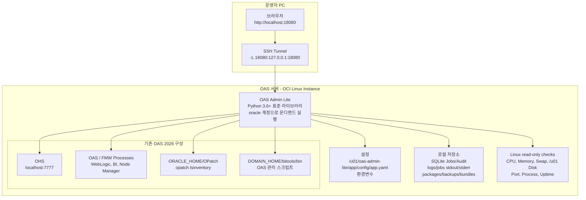
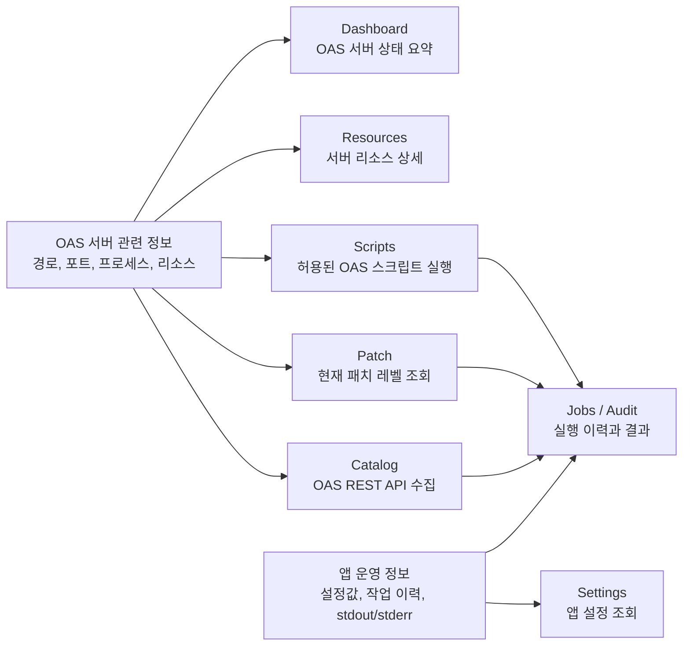
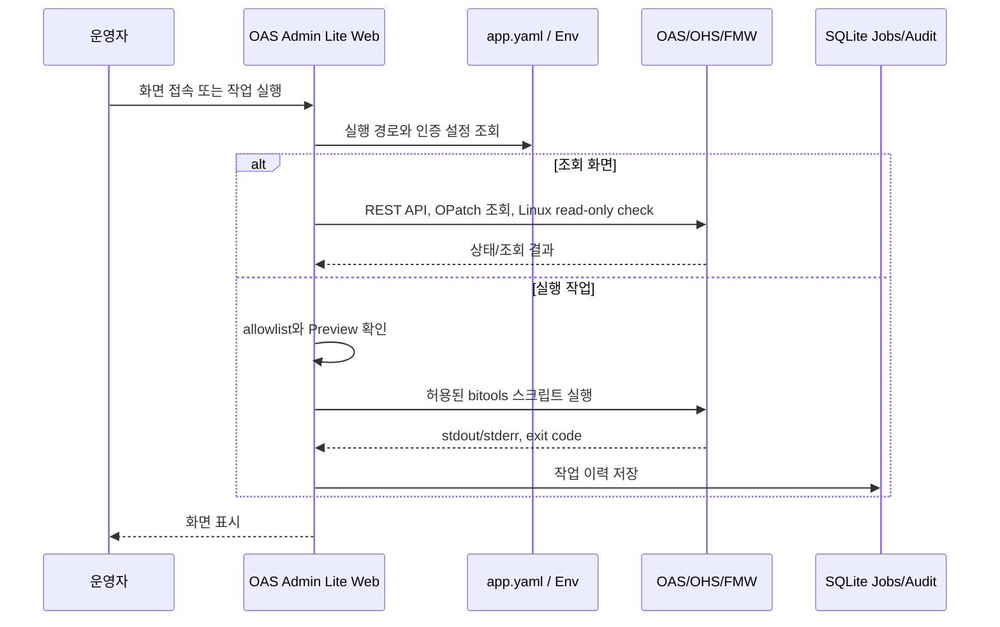

# OAS Admin Lite 소개 문서

## 1. 개요

OAS Admin Lite는 Oracle Analytics Server 2026 운영자를 위한 경량 관리자 보조 웹앱입니다.

이 앱은 온프레미스 고객의 OAS 서버에 추가 구성 부담을 최소화하기 위해 설계되었습니다. 상시 데몬으로 등록하지 않고, 운영자가 필요할 때 `oracle` 계정으로 실행한 뒤 작업이 끝나면 종료하는 온디맨드 방식입니다.

주요 목적은 다음과 같습니다.

- OAS 서버 리소스, 런타임 경로, listener/process 상태 확인
- OAS 카탈로그 현황 수집
- 현재 패치 레벨 확인
- Oracle 제공 OAS 관리 스크립트 실행
- 모든 실행 작업의 이력 및 결과 저장

## 2. 설계 원칙

### 최소 배포

OAS Admin Lite는 Python 표준 라이브러리만 사용합니다.

따라서 고객 서버에는 별도 `pip install`, Node.js, 외부 DB, systemd 등록이 필요하지 않습니다. 서버에 `python3`만 있으면 실행할 수 있습니다.

### oracle 계정 기반 운영

앱은 `oracle` 계정으로 실행하는 것을 기준으로 합니다.

OAS 관리 스크립트, 로그 조회, 작업 결과 저장도 모두 `oracle` 계정 권한 안에서 수행합니다. root 권한이 필요한 OS 변경 작업은 앱 자동화 범위에서 제외합니다.

### /u01 단일 배치

앱 관련 파일은 모두 `/u01/oas-admin-lite` 아래에 배치하는 것을 목표로 합니다.

```text
/u01/oas-admin-lite/
├─ app/
├─ data/
├─ logs/
├─ backups/
├─ bundles/
├─ packages/
├─ run/
└─ scripts/
```

### 안전한 실행 흐름

OAS 스크립트 실행처럼 변경 가능성이 있는 작업은 다음 흐름을 따릅니다.

```text
입력
→ Preview
→ 실행 확인 문구 입력
→ 실행
→ 결과 저장
→ Jobs / Audit 기록
```

## 3. 주요 기능

### 3.1 Dashboard

OAS 서버의 런타임 경로, 리소스, listener/process 상태를 시각적으로 요약해서 보여주는 첫 화면입니다.

표시 항목:

- Hostname
- OS / Architecture
- ORACLE_HOME 접근 상태
- DOMAIN_HOME 접근 상태
- bitools/bin 접근 상태
- OPatch 접근 상태
- CPU Load / Memory / Swap / `/u01` Disk 요약
- OAS/OHS listener 상태
- OAS/OHS process 상태

앱이 수행한 작업 이력은 Dashboard가 아니라 Jobs / Audit 화면에서 확인합니다.

### 3.2 Resources

CPU, Memory, Swap, `/u01` Disk, OAS/OHS listener, OAS/OHS process 상태를 상세 조회합니다.

Linux 서버에서는 다음 항목을 확인합니다.

- Load Average
- Memory
- `/u01` 파일시스템 사용량
- Listen port 상태
- OAS/FMW 주요 경로 존재 및 접근 가능 여부

이 화면은 조회 전용이며 서버 설정을 변경하지 않습니다.

### 3.3 Catalog

OAS REST API를 통해 카탈로그 현황을 수집하는 화면입니다.

현재 1차 구현은 설정된 `analytics_url`에 대한 REST 연결 확인과 JSON 응답의 object type 집계 골격을 제공합니다. 실제 고객 환경의 OAS REST catalog endpoint와 인증 방식이 확정되면 해당 API에 맞춰 수집 로직을 구체화합니다.

수집 결과는 SQLite에 저장되고 Jobs / Audit 화면에 기록됩니다. REST 인증은 `catalog_username`/`catalog_password` 또는 환경변수 `OAS_ADMIN_LITE_CATALOG_USERNAME`, `OAS_ADMIN_LITE_CATALOG_PASSWORD`를 사용합니다.

### 3.4 Patch

현재 OAS/FMW 패치 레벨을 조회하는 화면입니다.

지원 기능:

- `opatch lsinventory` 실행
- 현재 패치 레벨 조회
- 조회 결과와 실행 이력 저장

이 화면은 조회 전용입니다. 패치 파일 업로드, 사전 점검, `opatch apply` 실행은 1차 운영 화면에서 제외합니다.

### 3.5 Scripts

Oracle Analytics Server의 service instance/BAR 관련 관리 스크립트를 실행하는 화면입니다.

허용된 스크립트:

- `datamodel.sh`: semantic model, connection, data model 관련 정보 추출 또는 관리
- `diagnostic_dump.sh`: 장애 분석용 진단 dump 생성
- `exportarchive.sh`: Catalog/security/model 산출물을 BAR archive로 export
- `importarchive.sh`: BAR archive를 service instance로 import

설정된 `bitools/bin` 경로 아래의 스크립트만 실행합니다. 임의 shell 명령 실행 기능은 제공하지 않습니다.

화면에는 각 스크립트의 기능, 사용 방법, 결과 활용 방법을 함께 표시합니다. 실행 전 Preview를 통해 실제 실행될 명령을 확인하고, 실행 시에는 확인 문구 `RUN` 입력이 필요합니다.

### 3.6 Jobs / Audit

모든 주요 작업 이력을 저장하고 조회합니다.

저장 항목:

- 작업 시간
- 작업 유형
- 실행 명령
- 성공/실패 상태
- exit code
- stdout/stderr 요약
- 상세 로그 파일 경로

저장소는 SQLite 파일입니다.

```text
/u01/oas-admin-lite/data/oas-admin-lite.db
```

### 3.7 Settings

현재 앱 설정을 조회하는 화면입니다.

표시 항목:

- Listen address
- 앱 루트 경로
- Data / Logs / Backups / Bundles / Packages 경로
- ORACLE_HOME
- DOMAIN_HOME
- bitools/bin
- Analytics URL

1차 버전에서는 화면에서 설정을 직접 수정하지 않습니다. 설정 변경은 `app.yaml` 파일을 수정하는 방식입니다.

## 4. 작동 방식 및 구성 환경 아키텍처

OAS Admin Lite는 별도 WAS나 외부 DB를 두지 않고, OAS 서버 내부에서 Python 표준 라이브러리 기반 HTTP 앱으로 실행됩니다. 기본 접근 방식은 `127.0.0.1:18080` 로컬 바인딩과 SSH tunnel이며, 고객 내부망 정책에 따라 직접 접속 방식으로 바꿀 수 있습니다.

### 4.1 전체 구성도



### 4.2 화면별 책임 분리



Dashboard와 Resources는 OAS 서버 운영 상태를 보는 화면입니다. OAS Admin Lite 자체가 수행한 작업, 실행 결과, 로그, 설정값은 Jobs / Audit과 Settings로 분리해 운영자가 서버 상태와 앱 상태를 혼동하지 않도록 구성합니다.

### 4.3 런타임 호출 흐름



### 4.4 구성 환경 요약

| 구분 | 구성 |
| --- | --- |
| 실행 계정 | `oracle` |
| 기본 설치 경로 | `/u01/oas-admin-lite` |
| 실행 방식 | `scripts/start.sh`로 필요 시 실행, `scripts/stop.sh`로 종료 |
| 웹 바인딩 | 기본 `127.0.0.1:18080` |
| 권장 접속 | SSH tunnel |
| 런타임 | Python 3.6 이상, 표준 라이브러리 |
| 저장소 | SQLite 파일, 로컬 로그 파일 |
| OAS 연동 | Catalog REST API, OPatch, `bitools/bin` 관리 스크립트 |
| OS 연동 | CPU, Memory, Swap, Disk, port, process 조회 |
| 제외 항목 | systemd, sudoers, root 권한 자동화, 외부 DB, pip package |

## 5. 배포 구조

개발 산출물의 주요 구조는 다음과 같습니다.

```text
oas-admin-lite/
├─ app/
│  ├─ oas_admin_lite.py
│  ├─ config/
│  │  └─ app.yaml.sample
│  └─ oas_admin_lite/
│     ├─ app.py
│     ├─ catalog.py
│     ├─ command.py
│     ├─ config.py
│     ├─ patching.py
│     ├─ resources.py
│     ├─ scripts_runner.py
│     ├─ storage.py
│     ├─ web.py
│     └─ static/
│        └─ app.css
│
├─ configs/
│  ├─ app.yaml.sample
│  └─ app.local.yaml
│
├─ scripts/
│  ├─ install.sh
│  ├─ start.sh
│  ├─ stop.sh
│  ├─ status.sh
│  ├─ update.sh
│  ├─ rollback.sh
│  ├─ uninstall.sh
│  ├─ healthcheck.sh
│  └─ package.sh
│
├─ deploy/
│  └─ ohs/
│     └─ oas-admin-lite.conf.sample
│
├─ tests/
└─ README.md
```

서버 배포 후 권장 구조는 다음과 같습니다.

```text
/u01/oas-admin-lite/
├─ app/
│  ├─ oas_admin_lite.py
│  ├─ config/
│  │  └─ app.yaml
│  └─ oas_admin_lite/
│
├─ data/
│  └─ oas-admin-lite.db
│
├─ logs/
│  ├─ app.log
│  └─ jobs/
│
├─ backups/
├─ bundles/
├─ packages/
│  ├─ patches/
│  ├─ releases/
│  └─ rollback/
│
├─ run/
│  └─ oas-admin-lite.pid
│
└─ scripts/
```

## 6. 운영 흐름

### 6.1 설치

운영 서버에서 `oracle` 계정으로 실행합니다.

```bash
su - oracle
cd /u01/oas-admin-lite
./scripts/install.sh /u01/oas-admin-lite
```

설치 스크립트는 다음 작업을 수행합니다.

- `/u01/oas-admin-lite` 하위 디렉터리 생성
- 앱 파일 배치
- `app.yaml` 샘플 생성
- 실행 스크립트 권한 설정
- 앱 초기화 점검

### 6.2 설정

설정 파일은 다음 위치에 둡니다.

```text
/u01/oas-admin-lite/app/config/app.yaml
```

주요 설정:

```yaml
server:
  listen: "127.0.0.1:18080"

oas:
  oracle_home: "/u01/app/oracle/product/fmw"
  domain_home: "/u01/app/oracle/config/domains/bi"
  bitools_bin: "/u01/app/oracle/config/domains/bi/bitools/bin"
  analytics_url: "https://oas.example.com/analytics"
  catalog_base_url: "http://localhost:7777"
  catalog_api_path: "/api/20210901/catalog"
  catalog_api_url: ""
  catalog_username: ""
  catalog_password: ""
```

기본 listen 주소는 `127.0.0.1:18080`입니다. 외부에 직접 노출하지 않고 SSH tunnel로 접속하는 방식을 권장합니다.

### 6.3 시작

```bash
/u01/oas-admin-lite/scripts/start.sh
```

### 6.4 접속

보안상 기본 권장 방식은 SSH tunnel입니다.

```bash
ssh -L 18080:127.0.0.1:18080 oracle@oas-server
```

브라우저에서 다음 주소로 접속합니다.

```text
http://localhost:18080
```

### 6.5 상태 확인

```bash
/u01/oas-admin-lite/scripts/status.sh
```

### 6.6 종료

```bash
/u01/oas-admin-lite/scripts/stop.sh
```

### 6.7 업데이트

```bash
/u01/oas-admin-lite/scripts/update.sh /u01/oas-admin-lite/packages/releases/oas-admin-lite-x.y.z.tar.gz
```

업데이트 전 기존 앱 디렉터리는 rollback archive로 보관합니다.

### 6.8 롤백

```bash
/u01/oas-admin-lite/scripts/rollback.sh
```

또는 특정 롤백 파일을 지정할 수 있습니다.

```bash
/u01/oas-admin-lite/scripts/rollback.sh /u01/oas-admin-lite/packages/rollback/app-YYYYMMDD-HHMMSS.tar.gz
```

## 7. 보안 및 권한 정책

### 7.1 root 권한 미사용

OAS Admin Lite는 root 권한을 전제로 하지 않습니다.

다음 작업은 앱 자동화 대상에서 제외합니다.

- systemd 등록
- sudoers 등록
- `/etc` 파일 수정
- OS 패키지 설치
- firewall / SELinux 설정 변경
- root 권한 post-step 자동 실행

### 7.2 실행 계정

권장 실행 계정은 `oracle`입니다.

```bash
id
```

앱은 OAS/FMW 파일과 스크립트를 `oracle` 권한으로 접근할 수 있어야 합니다.

### 7.3 명령 실행 제한

앱은 임의 shell command 입력 기능을 제공하지 않습니다.

실행 가능한 명령은 코드와 설정에서 제한됩니다.

- OPatch: 설정된 `ORACLE_HOME/OPatch/opatch`
- OAS scripts: 설정된 `bitools/bin` 아래 allowlist 스크립트
- Patch path: 설정된 allowed patch directory 아래 경로

### 7.4 인증

1차 구현은 로컬 모드로 실행할 수 있습니다.

Basic Auth를 켜려면 `app.yaml` 또는 환경변수에 SHA-256 password hash를 설정합니다.

```yaml
security:
  username: "admin"
  password_sha256: "<sha256-hash>"
```

또는:

```bash
export OAS_ADMIN_LITE_PASSWORD_SHA256="<sha256-hash>"
```

## 8. 현재 구현 상태

현재 1차 MVP에서 구현된 항목:

- Python 3.6 이상 표준 라이브러리 기반 웹앱
- Dashboard 화면
- Resources 화면
- Catalog 화면 및 REST 호출 골격
- Patch 화면 및 OPatch 실행 골격
- Scripts 화면 및 allowlist 기반 실행
- Jobs / Audit SQLite 저장
- Settings 화면
- 온디맨드 start/stop/status/update/rollback/uninstall 스크립트
- 로컬 테스트 설정
- 단위 테스트

검증된 항목:

- Python 문법 컴파일
- 설정 파서 단위 테스트
- 앱 초기화 체크
- 7개 화면 HTTP 200 응답
- Scripts Preview POST 동작

## 9. 현재 제약 및 다음 단계

### 9.1 Catalog REST 상세화 필요

현재 Catalog 기능은 OAS REST API 연결과 JSON 응답 집계 골격까지 구현되어 있습니다.

다음 단계에서 고객 OAS 환경의 실제 REST endpoint, 인증 방식, 필요한 catalog object schema를 확인해 다음 항목을 구체화해야 합니다.

- catalog tree 조회
- object type별 정확한 집계
- shared folder 기준 필터링
- CSV/JSON 다운로드
- 실패 시 재시도 및 상세 오류 표시

### 9.2 OPatch 조회 확장

현재 Patch 화면은 `opatch lsinventory` 조회 전용입니다.

다음 단계에서 확장할 항목:

- 패치 ID 요약 파싱
- 적용 일자/패치 설명 컬럼화
- 조회 결과 다운로드
- 패치 전후 inventory snapshot 비교

### 9.3 OAS 스크립트 파라미터 UI 개선

현재 Scripts 화면은 공통 arguments 입력 방식입니다.

다음 단계에서는 스크립트별 전용 입력 화면으로 나누는 것이 좋습니다.

- `exportarchive.sh`: BAR 저장 경로, service instance
- `importarchive.sh`: BAR 파일 경로, 실행 전 백업 확인
- `diagnostic_dump.sh`: 번들 저장 경로
- `datamodel.sh`: BAR 파일 및 출력 경로

### 9.4 OAS 문서 기준 확인

OAS 관련 기능을 확장할 때는 OBIEE 문서가 아니라 Oracle Analytics Server 문서를 기준으로 확인해야 합니다.

특히 service instance/BAR 스크립트는 Oracle Analytics Server 문서의 `scripts-managing-service-instances` 내용을 기준으로 기능을 맞춥니다.

## 10. 요약

OAS Admin Lite는 OAS 2026 운영 서버에서 `oracle` 계정만으로 필요한 관리 작업을 보조하는 경량 온디맨드 웹앱입니다.

핵심 특징은 다음과 같습니다.

- `/u01/oas-admin-lite` 중심 배포
- Python 표준 라이브러리만 사용
- systemd/sudoers 없이 실행 가능
- 임의 shell 실행 차단
- OAS 스크립트는 Preview와 확인 절차 후 실행
- Jobs / Audit으로 모든 실행 이력 저장

1차 MVP는 운영 흐름과 화면 구조를 검증할 수 있는 수준까지 구현되어 있으며, 다음 개발 단계에서는 실제 OAS REST API와 고객 서버의 OPatch/OAS script 실행 결과를 기준으로 화면별 기능을 더 구체화하면 됩니다.
